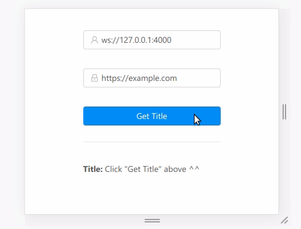

A minimal example of using puppeteer with react. Created for a [bug report here](https://github.com/parcel-bundler/parcel/issues/2847) on parcel-builder.



- Server only hosts puppeteer 
- Client does everything using `page.connect({})`

Usage:
```
git clone --recursive https://github.com/entrptaher/playground-react-puppeteer -b parcel

# Terminal 1
cd playground-react-puppeteer/server
yarn
yarn start

# Terminal 2
cd playground-react-puppeteer/client
yarn
yarn start
```

Now browse to `http://localhost:1234/` and click **Get Title**
